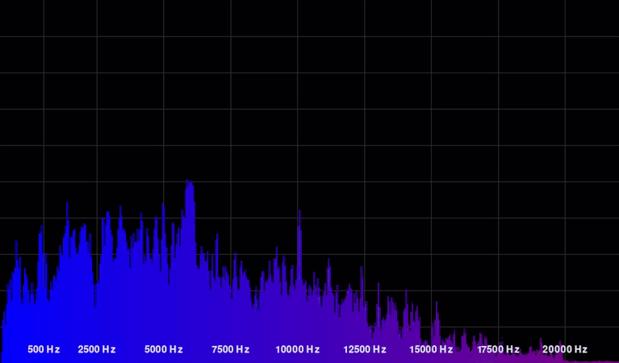

# 🐍 Spectrum Analyzer

A Python-based audio spectrum analyzer that visualizes a microphone input signal in real time. This project was developed as part of a university course in collaboration with two classmates. 

## Features
- Real-time audio recording via microphone
- FFT based frequency analysis
- Dynamic visualization with PyGame
- Color-coded frequency display

## Getting Started 
1. Create and activate virtual environment
2. Install dependencies: ```pip install -r requirements.txt``` 

### Prerequisites
Ensure you have the following installed on your system:
- Python 3.7 or later
- pip (Python package manager)

### Installation
1. Clone this repository:

    ```git clone https://github.com/felixgahler/Python-Spectrum-Analyser.git```
    
    ```cd python-spectrum-analyzer```

2. Install the required dependencies:

    ```pip install -r requirements.txt```


## Usage
### Running the Analyzer

Run the main script to start the spectrum analyzer:
```python main.py```

## Adjusting Settings
The following settings can be adjusted via the file config.py:
- Screen width and height
- Background color
- Grid color
- Volume factor
- Bars start and end color

## Demo


## License
This project is licensed under the MIT License. See the LICENSE file for details.

